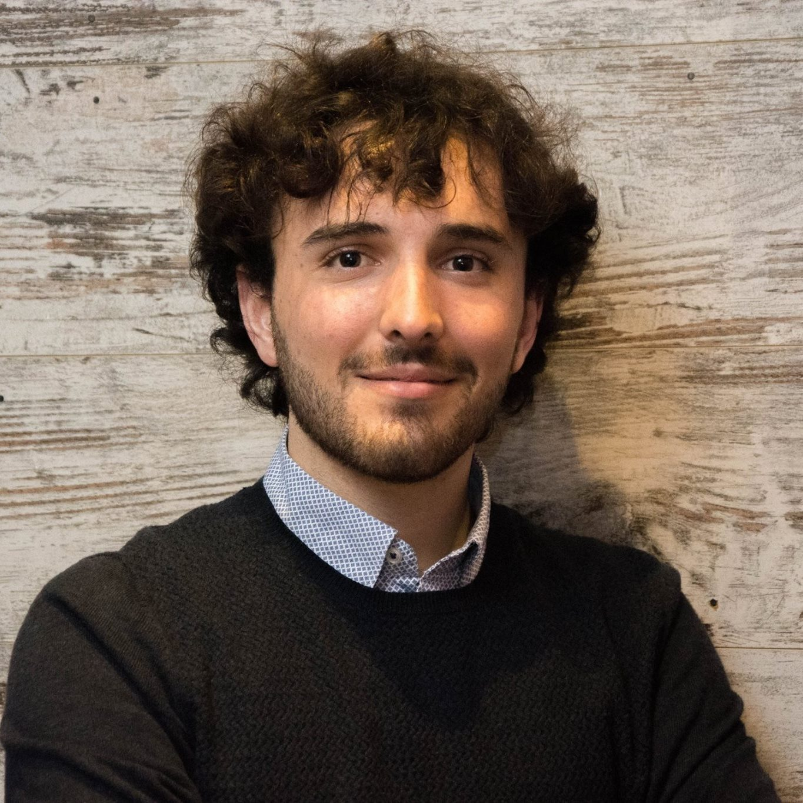

Piero Macaluso

Sanremo (IM) 18038 - Italia

Torino (TO) 10141 - Italia

(+39) 334 715 0020

<a href="mailto:info@pieromacaluso.com">info@pieromacaluso.com</a>

<a href="https://github.com/pieromacaluso">pieromacaluso</a>

<a href="https://linkedin.com/in/pieromacaluso">pieromacaluso</a>

<a href="https://join.skype.com/invite/pbo4o4gCKVnl">piero.macaluso@outlook.com</a>

### Master of Science in Computer Engineering - Software Career

*Oct. 2017 - Exp. Mar. 2020* - Politecnico di Torino - Turin, Italy

**Master Thesis**:
  - **Title**: Model-Free Reinforcement Learning algorithms applied to an autonomous driving task with a small real world robot.
  - **Research Centre**: EURECOM - Sophia Antipolis, Biot 06410, France
  - **Supervisors**: Prof. Pietro Michiardi (EURECOM) - Prof. Elena Baralis (Politecnico di Torino)

### Bachelor in Computer Engineering (184 CFU)
*Sep. 2014 - Oct. 2017* - Politecnico di Torino - Turin, Italy

**Final Mark**: 110/110 cum laude

### Liceo Scientifico P.N.I. Diploma

*Sep. 2009 - Jul. 2014* - Liceo G.D. Cassini - Sanremo, Italy

**Final Mark**: 100/100 cum laude

# Professional Experiences

Prova

# Personal Experiences and Projects

Prova