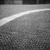
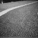
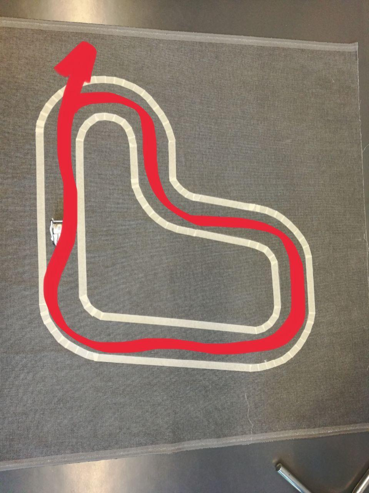
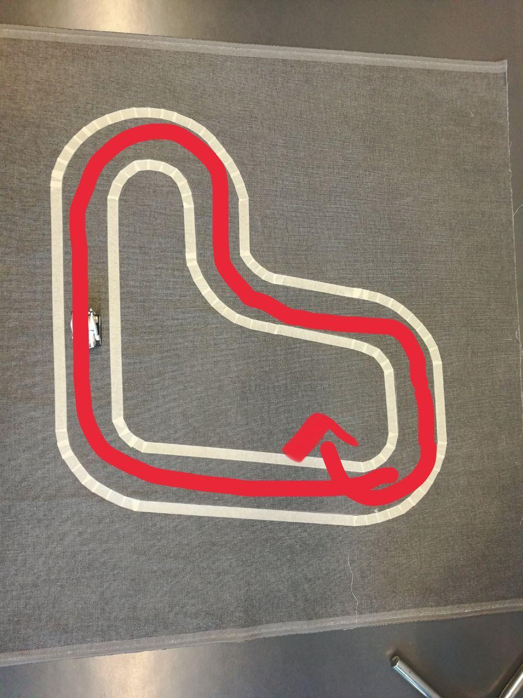

This page was created to show one episode of learning of my master thesis project "Model-Free Deep Reinforcement Learning algorithms applied to Autonomous Systems" I developed at EURECOM in Sophia Antipolis (Biot, France).

# Front View

Episodio 2748

Episodio 2876

# Total path

Episodio 2748

Episodio 2876

